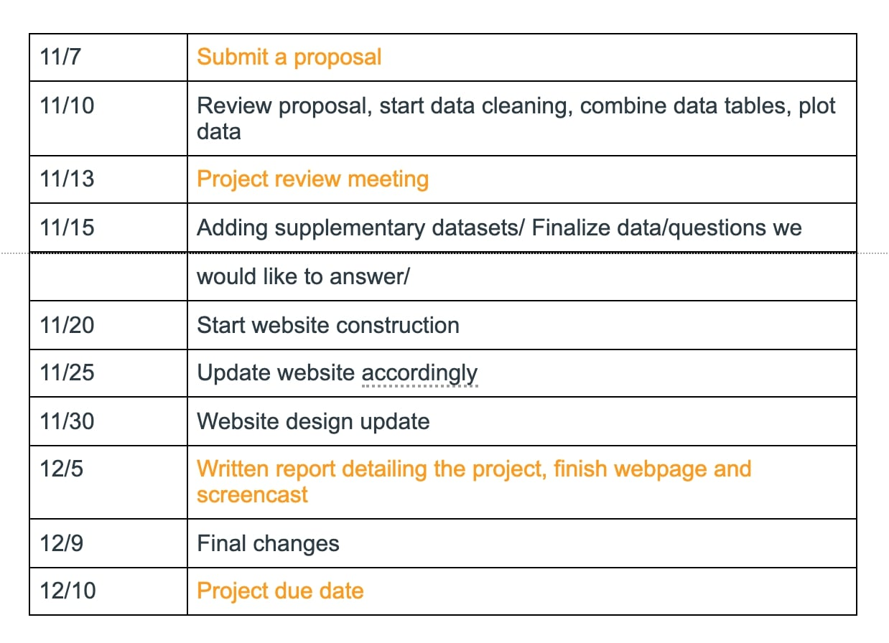

Final Project Proposal
================
Elaine Xu (yx2640), Jiayi Zhou(jz3336), Rio Yan(xy2476), Ximeng
Zhao(xz3032)
11/6/2020

## Introduction

Childhood obesity is a major concern in the United States. In nowadays,
obesity is putting children and adolescents at risk for poor health.
Obesity prevalence among children and adolescents is very high.
According to the CDC website, obesity prevalence was 13.9% among 2- to
5-year-olds, 18.4% among 6- to 11-year-olds, and 20.6% among 12- to
19-year-olds. Childhood obesity is also more common among certain
populations.

### Timeline:

