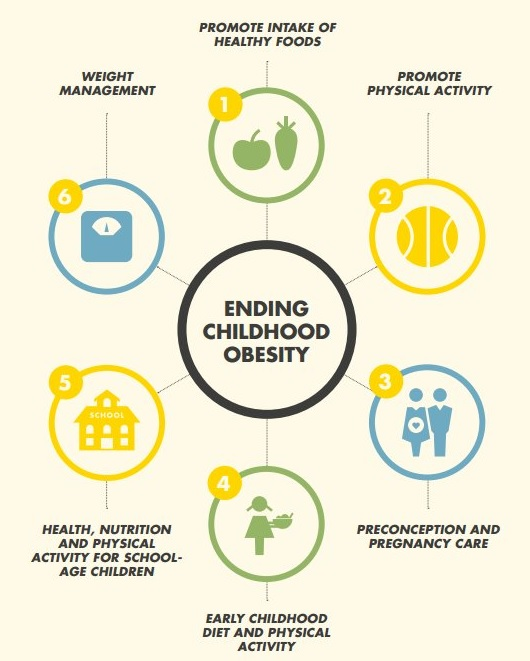
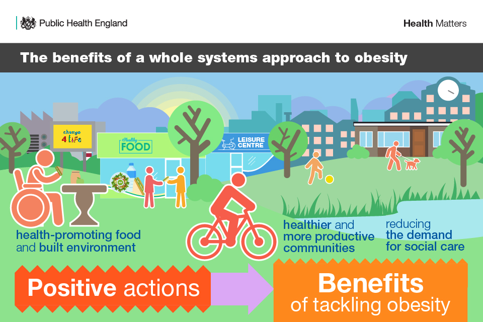

```{r, include=FALSE,message=FALSE,echo=FALSE}
library(tidyverse)
library(readxl)
library(plotly)

knitr::opts_chunk$set(
  fig.width = 9,
  fig.asp = .6,
  out.width = "90%")

theme_set(theme_minimal() + theme(legend.position = "bottom"))

options(
  ggplot2.continuous.colour = "viridis",
  ggplot2.continuous.fill = "viridis"
)

scale_colour_discrete = scale_color_viridis_d
scale_fill_discrete = scale_fill_viridis_d
```


# Interventions on Obesity in Students


### Tips to Help Children Maintain a Healthy Weight


[CDC Recommendations](https://www.cdc.gov/healthyweight/children/index.html)

[NY Department of Health](https://www.health.ny.gov/prevention/nutrition/resources/obparnts.htm)

<center>

<center>

&nbsp;

### Community Help - ParentCorps Intervention

ParentCorps is a multi-level intervention that promote healthy child behavior in low-income neighborhoods.

[ParentCorps-Blueprints for Healthy Youth Development](https://www.blueprintsprograms.org/programs/1291999999/parentcorps/print/)

[ParentCorps | NYU Langone Health](https://med.nyu.edu/departments-institutes/population-health/divisions-sections-centers/health-behavior/center-early-childhood-health-development/parentcorps)


### Improvements in the Built Environments 

[Whole Systems Approach to Obesity](https://echalliance.com/health-matters-whole-systems-approach-to-obesity/)

<center>

<center>
