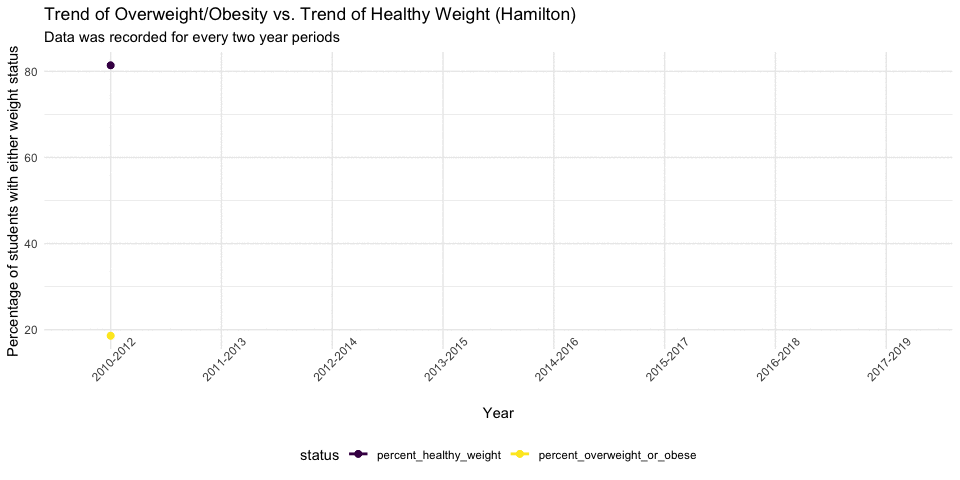

<style type="text/css">

h1.title {
  text-align: center;
}

</style>

```{r setup, include = FALSE}
library(tidyverse)
library(plotly)
library(rgdal)
library(plotly)
library(maps)
library(devtools)
library(leaflet)
library(BAMMtools)
library(spdep)
library(maptools)
library(leafsync)
library(gganimate)

knitr::opts_chunk$set(
  message = FALSE,
  warning = FALSE,
  fig.width = 10,
  fig.asp = .6,
  out.width = "90%"
)

theme_set(theme_minimal() + theme(legend.position = "bottom"))

options(
  ggplot2.continuous.colour = "viridis",
  ggplot2.continuous.fill = "viridis"
)

scale_colour_discrete = scale_colour_viridis_d
scale_fill_discrete = scale_fill_viridis_d

```

```{r, include = FALSE}
# Clean the orginal weight dataset
original = tibble(
  read.csv("./dataset/Student_Weight_Status_Category_Reporting_Results__Beginning_2010.csv")
) %>%
  janitor::clean_names() %>%
  select(-location_code, -area_name, -region)  # the only location information we need is county name
```

```{r, echo = FALSE} 
# FIPS code:https://data.ny.gov/Government-Finance/New-York-State-ZIP-Codes-County-FIPS-Cross-Referen/juva-r6g2
fips_code = tibble(
  read.csv("./map_data_jyz/New_York_State_ZIP_Codes-County_FIPS_Cross-Reference.csv")
) %>%
  janitor::clean_names() %>% 
  rename("county" = county_name, "fips" = county_fips) %>% 
  select(county, fips) %>% # only information we need is county name and geolocation
  distinct() %>% 
  mutate(county = toupper(county)) # to swith county name to uppercase
```

```{r, echo = FALSE}
weight_df = 
  left_join(original, fips_code, by = "county") %>% 
  filter(county != "STATEWIDE (EXCLUDING NYC)")
  
average_percent_oo = 
  weight_df %>% 
  group_by(county) %>% 
  drop_na(percent_overweight_or_obese) %>%
  summarize(percent_oo = mean(percent_overweight_or_obese), .groups = "keep")

average_percent_healthy = 
  weight_df %>% 
  group_by(county) %>% 
  drop_na(percent_healthy_weight) %>%
  summarize(percent_healthy = mean(percent_healthy_weight), .groups = "keep") %>%
  mutate(percent_healthy = percent_healthy*100)

#tidy dataframe contain only two average percentage and the mapping info
sum_df = 
  left_join(average_percent_oo,average_percent_healthy, by = "county") %>% 
  left_join(fips_code, by = "county") %>% 
  mutate(fips_code = as.character(fips))
```


```{r, include = FALSE}
#import shp file:http://gis.ny.gov/gisdata/inventories/details.cfm?DSID=927
fips_map = readOGR(dsn = "./map_data_jyz/NYS_Civil_Boundaries_SHP/Counties.shp", encoding = "UTF-8")

fips_map@data<- left_join(fips_map@data, sum_df, by = c("FIPS_CODE" = "fips_code"))

#assign 0 to NAs
fips_map$percent_healthy[is.na(fips_map$percent_healthy)] <- 0
fips_map$percent_oo[is.na(fips_map$percent_oo)] <- 0
```

```{r, echo = FALSE}
# CRS setting
fips_map_crs = spTransform(fips_map, CRS("+init=epsg:4326"))
# export the json file
writeOGR(fips_map_crs, './map_data_jyz/fips_map_geojson', layer = 'fips_map', driver = 'GeoJSON', overwrite_layer = TRUE)
```

```{r, include = FALSE}
# format of the label that pops up for each polygon
label_popup_oo = paste0(
  "<strong>FIPS code: </strong>",
  fips_map$FIPS_CODE,
  "<br><strong>County Name: </strong>",
  fips_map$NAME,
  "<br><strong>Percent of Overweight or Obese: </strong>",
  fips_map$percent_oo
)

# get jenks natural break for average
getJenksBreaks(fips_map$percent_oo, 5)

# set bins
percent_oo_bins <- c(26,30,34,38,43)

# set pals
percent_oo_pal <- colorBin('Reds', bins = percent_oo_bins, na.color = '#d9d9d9')
```

```{r, include = FALSE}
# format of the label that pops up for each polygon
label_popup_healthy = paste0(
  "<strong>FIPS code: </strong>",
  fips_map$FIPS_CODE,
  "<br><strong>County Name: </strong>",
  fips_map$NAME,
  "<br><strong>Percent of Healthy Weight: </strong>",
  fips_map$percent_healthy
)

# get jenks natural break for average
getJenksBreaks(fips_map$percent_healthy, 5)

# set bins
percent_healthy_bins <- c(55,60,65,70,81)

# set pals
percent_healthy_pal <- colorBin('Blues', bins = percent_healthy_bins, na.color = '#d9d9d9')
```

```{r, echo = FALSE}
# choropleth overweight/obese map
oo_map = leaflet::leaflet(data = fips_map_crs) %>% 
  addProviderTiles('CartoDB.Positron') %>% 
  addPolygons(fillColor = ~percent_oo_pal(percent_oo),
              fillOpacity = 0.8,
              color = "#BDBDC3",
              weight = 1,
              popup = label_popup_oo,
              highlightOptions = highlightOptions(color = "black", weight = 2,
      bringToFront = TRUE)) %>% 
  addLegend('bottomleft',
            pal = percent_oo_pal,
            values = ~percent_oo,
            title = "The Average Percentage of Students Who were Overweight/Obese (2010-2019)",
            opacity = 1)
```


```{r, echo = FALSE}
# choropleth healthy weight map
healthy_map = leaflet::leaflet(data = fips_map_crs) %>% 
  addProviderTiles('CartoDB.Positron') %>% 
  addPolygons(fillColor = ~percent_healthy_pal(percent_healthy),
              fillOpacity = 0.8,
              color = "#BDBDC3",
              weight = 1,
              popup = label_popup_healthy,
              highlightOptions = highlightOptions(color = "black", weight = 2,
      bringToFront = TRUE)) %>% 
  addLegend('bottomleft',
            pal = percent_healthy_pal,
            values = ~percent_healthy,
            title = "The Average Percentage of Students Who Maintained Healthy Weight (2010-2019)",
            opacity = 1)
```

### Choropleth Map:
This map includes weight information collected from students who were in two grade levels: `ELEMENTARY` or `MIDDLE/HIGH`. They came from __`r nrow(average_percent_oo)`__ counties in the New York State, while New York City was excluded from the data. The percent of students who were overweight or obese and the percent of students who maintained a healthy weight were selected as indicator variables to represent the student's weight situation in the corresponding counties. Since data was collected over a __9-years-period__, an average of the selected percentages was taken and mapped.
<br>
The average percentage of students who were overweight or obese across 9 years and `r nrow(average_percent_oo)` New York counties were mapped in __red__. The darker the red color, the larger percentage of overweight or obese students can be found in the county. The average percentage of students who maintained healthy weight were mapped in __blue__, where the darker the blue color, the larger percentage of students in the county maintained a healthy weight. 
```{r echo = FALSE}
#putting maps side by side
sync(oo_map, healthy_map, ncol = 2, sync = "all", sync.cursor = TRUE, no.initial.sync = TRUE)
```
<br>
Overall, on average, there were higher percentage of students who maintained a healthy weight across the `r nrow(average_percent_oo)` counties, and the two maps echo each other nicely. However, there are a few exceptions. Take `HAMILTON` as an example, it is colored as deep red and deep blue at the same time, which means it not only exhibits high average percentage of overweight or obesity but also has high average percentage of students with healthy weight.

```{r, include=FALSE}
hamilton_df = 
  tibble(
    read.csv("./dataset/Student_Weight_Status_Category_Reporting_Results__Beginning_2010.csv")
) %>%
  janitor::clean_names() %>% 
  filter(county == "HAMILTON" & sex == "ALL") %>% 
  select(county,area_name,year_reported, grade_level,
         percent_overweight_or_obese, percent_healthy_weight) %>% 
  mutate(percent_healthy_weight = percent_healthy_weight *100)

tidy_hamilton = 
  hamilton_df[!with(hamilton_df,is.na(percent_overweight_or_obese)& is.na(percent_healthy_weight)),] %>% 
  filter(area_name == "HAMILTON" & grade_level == "DISTRICT TOTAL") %>% 
  pivot_longer(
    percent_overweight_or_obese:percent_healthy_weight,
    names_to = "status",
    values_to = "percent"
  ) %>% 
  mutate(year_reported = as.factor(year_reported)) %>%
  ggplot(aes(x = year_reported, y = percent, group = status, color = status)) + 
  geom_line(size = 1) +
  geom_point(size = 2) + 
  labs(title = "Trend of Overweight/Obesity vs. Trend of Healthy Weight (Hamilton)",
       subtitle = "Data was recorded for every two year periods",
       x = "Year", 
       y = "Percentage of students with either weight status") +
  theme(axis.text.x = element_text(angle = 45)) %>%
  na.omit()

gif <- animate(tidy_hamilton +geom_point(aes(group = seq_along(year_reported)), size = 2)+ transition_reveal(as.numeric(year_reported)) + enter_fade() + exit_shrink(), fps = 20)

anim_save("gif.gif", gif, path = "~/Documents/Columbia Data Science/Final/P8105_final_project/map_data_jyz")
```

### Hamilton

To explore the reason why `HAMILTON` was colored in darker colors in both choropleth maps, `HAMILTON` was separated from the original collective data and analyzed independently. We found that as time goes by, students' weight in `HAMILTON` exhibited an increasing trend. As one of the healthiest counties with less than 20% of overweight/obese students, `HAMILTON`'s current situation is very concerning since about 40% of students were classified as overweight or obese by 2019. Students who were obese at the beginning of this study may have maintained to be obese, while students who were originally weighted as healthy gained weight. In total, there were more obese students by the end of the 9-years-period compare to the beginning of the study.

<br>


### Outlook
Since the choropleth maps used the average percentage, the changing trend of student weight was neglected. Both the average percent of overweight/obese and healthy students were large for `HAMILTON`. When analyzing all connties in the New York state, even though students' weight in some counties may have been relatively stable over the 9 years, it is still necessary to take yearly change into consideration.
