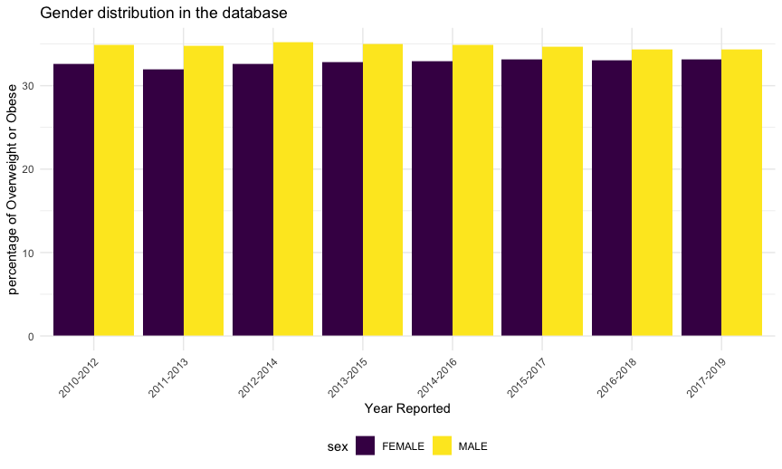

Raw Regression
================

``` r
library(tidyverse)
```

    ## ── Attaching packages ─────────────────────────────────────────────────────────────────── tidyverse 1.3.0 ──

    ## ✓ ggplot2 3.3.2     ✓ purrr   0.3.4
    ## ✓ tibble  3.0.3     ✓ dplyr   1.0.2
    ## ✓ tidyr   1.1.2     ✓ stringr 1.4.0
    ## ✓ readr   1.3.1     ✓ forcats 0.5.0

    ## ── Conflicts ────────────────────────────────────────────────────────────────────── tidyverse_conflicts() ──
    ## x dplyr::filter() masks stats::filter()
    ## x dplyr::lag()    masks stats::lag()

We planned to use linear regression model to analysis the association
between obesity rate and other variables like sex, grade level, economic
status, etc. The resulting model can give us a sense of which factor
influences obesity rate the most.

Basic variables that we are interested in:

**Sex** **Grade Level** **Economic Status** **Food Access Ability**

# Exploratory data analysis

## Sex

``` r
original = 
  tibble(
  read.csv("./dataset/Student_Weight_Status_Category_Reporting_Results__Beginning_2010.csv")
) %>%
  janitor::clean_names()

sex_df = 
  original %>% 
  mutate(
    percent_healthy_weight = percent_healthy_weight * 100
  ) %>% 
  select(county, region, year_reported, percent_overweight_or_obese, grade_level, sex) %>% 
  filter(sex == "MALE" | sex == "FEMALE") %>%
  filter(grade_level == "DISTRICT TOTAL") %>% 
  filter(county == "STATEWIDE (EXCLUDING NYC)") %>% 
  select(year_reported, percent_overweight_or_obese, sex)

sex_count = 
  sex_df %>% 
  group_by(year_reported) 

sex_count %>% 
  ggplot(aes(x = as.factor(year_reported), y = percent_overweight_or_obese, fill = sex)) +
  geom_bar(stat='identity') +
  ggtitle("Gender distribution in the database") +
  theme(axis.text.x = element_text(angle = 45, hjust = 1))
```

<!-- -->
