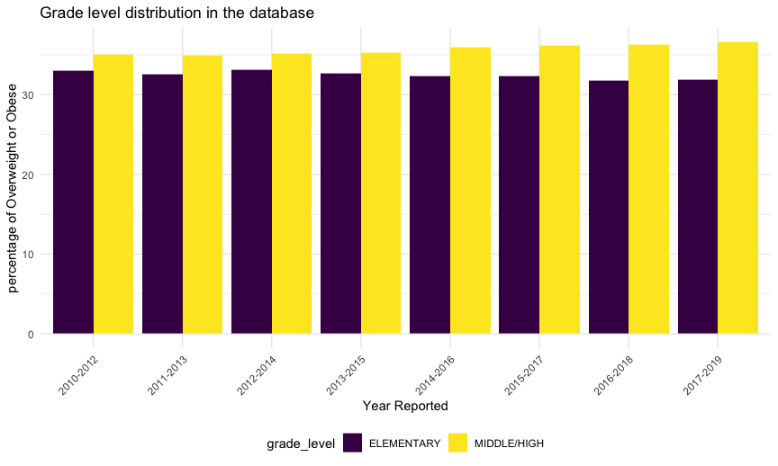

Raw Regression
================

``` r
library(tidyverse)
<<<<<<< HEAD
```

    ## ── Attaching packages ───────────────────────────────────────────────────────────────────────────── tidyverse 1.3.0 ──

    ## ✓ ggplot2 3.3.2     ✓ purrr   0.3.4
    ## ✓ tibble  3.0.3     ✓ dplyr   1.0.2
    ## ✓ tidyr   1.1.2     ✓ stringr 1.4.0
    ## ✓ readr   1.3.1     ✓ forcats 0.5.0

    ## ── Conflicts ──────────────────────────────────────────────────────────────────────────────── tidyverse_conflicts() ──
    ## x dplyr::filter() masks stats::filter()
    ## x dplyr::lag()    masks stats::lag()

``` r
=======

>>>>>>> 8d1ce10e06e42859bbc9ec1451d3a2493cf9187a
knitr::opts_chunk$set(
  fig.width = 9,
  fig.asp = .6,
  out.width = "90%")
```

We planned to use linear regression model to analysis the association
between obesity rate and other variables like sex, grade level, economic
status, etc. The resulting model can give us a sense of which factor
influences obesity rate the most.

Basic variables that we are interested in:

**Sex** **Grade Level** **Economic Status** **Food Access Ability**

# Exploratory data analysis

## Sex

The graph below shows that more male students are in the overweight or
obese category each year than female students.It seems like the
percentage for male in the overweight or obese category slightly
decreases and female slightly increases over years.

``` r
original = 
  tibble(
  read.csv("./dataset/Student_Weight_Status_Category_Reporting_Results__Beginning_2010.csv")
) %>%
  janitor::clean_names()

sex_df = 
  original %>% 
  mutate(
    percent_healthy_weight = percent_healthy_weight * 100
  ) %>% ## when importing data the percent healthy weight was distorted so i timed 100
  select(county, region, year_reported, percent_overweight_or_obese, grade_level, sex) %>% 
  filter(sex == "MALE" | sex == "FEMALE") %>%
  filter(grade_level == "DISTRICT TOTAL") %>% 
  filter(county == "STATEWIDE (EXCLUDING NYC)") %>% 
  select(year_reported, percent_overweight_or_obese, sex)

sex_count = 
  sex_df %>% 
  group_by(year_reported) 

sex_count %>% 
  ggplot(aes(x = as.factor(year_reported), y = percent_overweight_or_obese, fill = sex)) +
  geom_bar(stat='identity', position = "dodge") +
  labs(title = "Gender distribution in the database",
       x = "Year Reported",
       y = "percentage of Overweight or Obese") +
  theme(axis.text.x = element_text(angle = 45, hjust = 1))
```


## Grade Level

The graph below shows that students in middle/high school grade level
tend to have higher percentage than the elementary students in
overweight or obese category each year. There also seems to be an
increase in the overweight or obese percentage for the middle or high
school students while a decrease for the elementary students over years.

``` r
grade_df = 
  original %>% 
  select(county, region, year_reported, percent_overweight_or_obese, grade_level, sex) %>% 
  filter(sex %in% "ALL") %>% 
  filter(grade_level %in% c("ELEMENTARY", "MIDDLE/HIGH")) %>% 
  filter(county == "STATEWIDE (EXCLUDING NYC)") %>% 
  select(year_reported, percent_overweight_or_obese, grade_level)
  
grade_count = 
  grade_df %>% 
  group_by(year_reported)
  
grade_count %>% 
  ggplot(aes(x = as.factor(year_reported), y = percent_overweight_or_obese, fill = grade_level)) +
  geom_bar(stat='identity', position = "dodge") +
  labs(title = "Grade level distribution in the database",
       x = "Year Reported",
       y = "percentage of Overweight or Obese") +
  theme(axis.text.x = element_text(angle = 45, hjust = 1))
```



##
