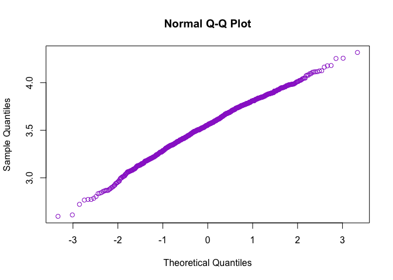
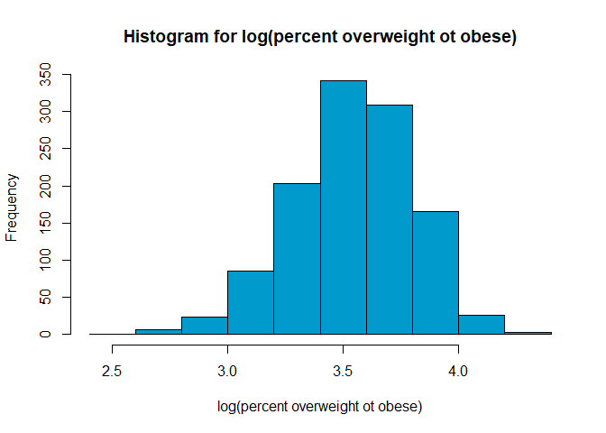
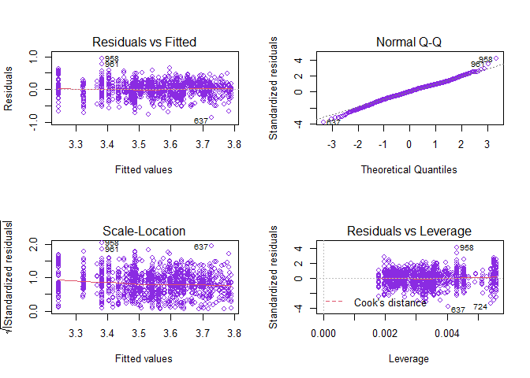

Regression - Statistical Analysis
================

    ## `summarise()` ungrouping output (override with `.groups` argument)

Before doing the linear regression model, I used two types of
transformation to improve the adequacy, a. y’ = log(y), b. y’= y^0.5,
Q\_Q plot showed that the log tansformation has improved data’s
normality.  
<!-- --><!-- -->
Above are the Q-Q plot and histogram of overweight/obesity data after
log transformation. Q-Q plot is perfectly linear distributed, histogram
is normally distributed with a little left skewness. Overall, the
normality assumption is satisfied.

In the beginning we used included 4 independent variables, grade level,
median income, food insecurity and gender, however the model summary
showed there is a very weak correlation between gender and our dependent
variable - percent overweight and obese, so we took gender factor out,
model is furthurly improved, left four variables all significantly
influenced the percent overweight and obese.

## Statistics Model

## log(y) = 4.54 + 0.16x1 - 0.01x2 - 0.03x3

y = percent overweight or obese  
x1 = grade level  
x2 = median income (kilodollar)  
x3 = food insecurity percentage

``` r
# regression model
lm_1 = lm(log(percent_overweight_or_obese) ~ grade_level + median_income + food_insecurity_p, data = linear_df3) 
summary(lm_1)
```

    ## 
    ## Call:
    ## lm(formula = log(percent_overweight_or_obese) ~ grade_level + 
    ##     median_income + food_insecurity_p, data = linear_df3)
    ## 
    ## Residuals:
    ##      Min       1Q   Median       3Q      Max 
    ## -0.84887 -0.13917  0.00674  0.15418  0.93503 
    ## 
    ## Coefficients:
    ##                     Estimate Std. Error t value Pr(>|t|)    
    ## (Intercept)        4.5411958  0.1269828  35.762  < 2e-16 ***
    ## grade_level        0.1605545  0.0133570  12.020  < 2e-16 ***
    ## median_income     -0.0100907  0.0009203 -10.965  < 2e-16 ***
    ## food_insecurity_p -0.0385197  0.0064664  -5.957  3.4e-09 ***
    ## ---
    ## Signif. codes:  0 '***' 0.001 '**' 0.01 '*' 0.05 '.' 0.1 ' ' 1
    ## 
    ## Residual standard error: 0.2275 on 1160 degrees of freedom
    ## Multiple R-squared:  0.2526, Adjusted R-squared:  0.2507 
    ## F-statistic: 130.7 on 3 and 1160 DF,  p-value: < 2.2e-16

``` r
par(mfrow = c(2, 2))
plot(lm_1)
```

<!-- -->
