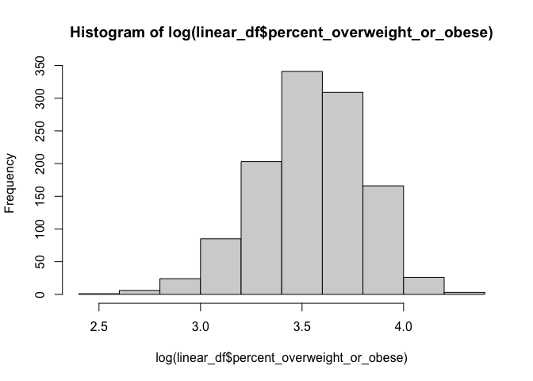
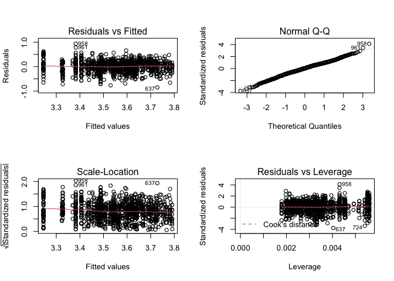

Regression - Statistical Analysis
================

``` r
library(tidyverse)
```

    ## ── Attaching packages ────────────────────────────────────────────────────────────── tidyverse 1.3.0 ──

    ## ✓ ggplot2 3.3.2     ✓ purrr   0.3.4
    ## ✓ tibble  3.0.3     ✓ dplyr   1.0.2
    ## ✓ tidyr   1.1.2     ✓ stringr 1.4.0
    ## ✓ readr   1.3.1     ✓ forcats 0.5.0

    ## ── Conflicts ───────────────────────────────────────────────────────────────── tidyverse_conflicts() ──
    ## x dplyr::filter() masks stats::filter()
    ## x dplyr::lag()    masks stats::lag()

``` r
library(patchwork)
library(readxl)
```

# Clean the orginal weight dataset

``` r
original = tibble(
  read.csv("./dataset/Student_Weight_Status_Category_Reporting_Results__Beginning_2010.csv")
) %>%
  janitor::clean_names() %>%
  select(-location_code, -region, -area_name)  # the only location information we need is county name
```

# Clean dataset with geolocation information

``` r
#import coordinates data set 
coordinates = tibble(
  read.csv("./dataset/Geocodes_USA_with_Counties.csv")
) %>%
  filter(state == "NY") %>%  # filter out counties outside NY state
  select(county, latitude, longitude) %>% # only information we need is county name and geolocation
  drop_na() %>%
  group_by(county) %>%
  summarise(latitude = mean(latitude), longitude = mean(longitude)) %>% #different location in each county variaed slightly, so we take the mean of each county's geolocation
  filter(!county == "") %>% # one county's name input is blank
  mutate(county = toupper(county)) # to swith county name to uppercase
```

    ## `summarise()` ungrouping output (override with `.groups` argument)

# combine two data set

``` r
weight_df = left_join(original, coordinates, by = "county")
```

# Further orginal dataset cleanning for linea regression analysis

``` r
linear_df = weight_df %>%
  filter(!sex == "ALL") %>%
  filter(!grade_level == "DISTRICT TOTAL") %>%
  mutate(
    sex = if_else(sex == "MALE", 0, 1),
    grade_level = if_else(grade_level == "ELEMENTARY", 0, 1)
  ) %>%
  drop_na() %>%
  filter(year_reported %in% c("2018-2019")) #only analyzing data in year 2018-2019
```

# Import tidy and join the median income and food insecurity data

``` r
income = read_xlsx("./dataset/median_income.xlsx") %>%
  janitor::clean_names() %>%
  rename(county = region_county) %>%
  mutate(median_income = median_income*0.001,
         county = toupper(county))

food_insecurity = read_xlsx("./dataset/food_insecurity.xlsx") %>%
  janitor::clean_names() %>%
    rename(county = region_county) %>%
  rename(food_insecurity_p = percentage) %>%
  mutate(county = toupper(county))

linear_df2 = left_join(linear_df, income, by = "county")
linear_df3 = left_join(linear_df2, food_insecurity, by = "county")
```

# Normality check

``` r
qqnorm(log(linear_df$percent_overweight_or_obese))
```

<!-- -->

``` r
hist(log(linear_df$percent_overweight_or_obese))
```

<!-- -->

# regression model

``` r
lm_1 = lm(log(percent_overweight_or_obese) ~ grade_level + median_income + food_insecurity_p, data = linear_df3)
summary(lm_1)
```

    ## 
    ## Call:
    ## lm(formula = log(percent_overweight_or_obese) ~ grade_level + 
    ##     median_income + food_insecurity_p, data = linear_df3)
    ## 
    ## Residuals:
    ##      Min       1Q   Median       3Q      Max 
    ## -0.84887 -0.13917  0.00674  0.15418  0.93503 
    ## 
    ## Coefficients:
    ##                     Estimate Std. Error t value Pr(>|t|)    
    ## (Intercept)        4.5411958  0.1269828  35.762  < 2e-16 ***
    ## grade_level        0.1605545  0.0133570  12.020  < 2e-16 ***
    ## median_income     -0.0100907  0.0009203 -10.965  < 2e-16 ***
    ## food_insecurity_p -0.0385197  0.0064664  -5.957  3.4e-09 ***
    ## ---
    ## Signif. codes:  0 '***' 0.001 '**' 0.01 '*' 0.05 '.' 0.1 ' ' 1
    ## 
    ## Residual standard error: 0.2275 on 1160 degrees of freedom
    ## Multiple R-squared:  0.2526, Adjusted R-squared:  0.2507 
    ## F-statistic: 130.7 on 3 and 1160 DF,  p-value: < 2.2e-16

``` r
par(mfrow = c(2, 2))
plot(lm_1)
```

<!-- -->
