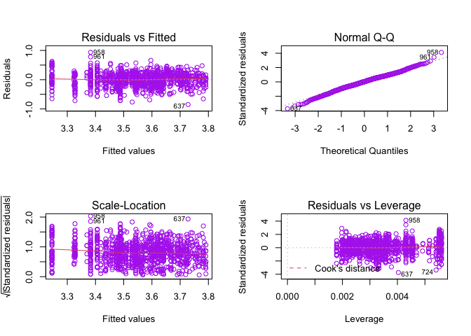

Regression - Statistical Analysis
================

    ## `summarise()` ungrouping output (override with `.groups` argument)

# Normality Check and Data Transformation

Before fitting the linear regression model, I used two types of
transformation to improve model adequacy, a. y’ = log(y), b. y’= y^0.5,
Q\_Q plot showed that the log tansformation has improved data’s
normality.

<!-- -->

    ## `stat_bin()` using `bins = 30`. Pick better value with `binwidth`.

<!-- -->

Above are the Q-Q plot and histogram of overweight/obesity data after
log transformation. Q-Q plot is in a perfect straight line, histogram is
normally distributed but a bit skewed to the left. Overall, the
normality assumption is satisfied.

# Statistics Model

In the beginning we included 4 independent variables, grade level,
median income, food insecurity and gender, however the model summary
showed there is a very weak correlation between gender (p-value = 0.168)
and dependent variable, so we took gender out from the model, left four
variables all significantly influenced the percentage overweight and
obese.

# Final Model: log(y) = 4.54 + 0.16x1 - 0.01x2 - 0.03x3

y = percentage overweight or obese  
x1 = grade level (0 = elementary, 1 = middle/high school)  
x2 = median income (k dollars)  
x3 = food insecurity percentage

# Model Summary

``` r
summary(lm_1)
```

    ## 
    ## Call:
    ## lm(formula = log(percent_overweight_or_obese) ~ grade_level + 
    ##     median_income + food_insecurity_p, data = linear_df3)
    ## 
    ## Residuals:
    ##      Min       1Q   Median       3Q      Max 
    ## -0.84887 -0.13917  0.00674  0.15418  0.93503 
    ## 
    ## Coefficients:
    ##                     Estimate Std. Error t value Pr(>|t|)    
    ## (Intercept)        4.5411958  0.1269828  35.762  < 2e-16 ***
    ## grade_level        0.1605545  0.0133570  12.020  < 2e-16 ***
    ## median_income     -0.0100907  0.0009203 -10.965  < 2e-16 ***
    ## food_insecurity_p -0.0385197  0.0064664  -5.957  3.4e-09 ***
    ## ---
    ## Signif. codes:  0 '***' 0.001 '**' 0.01 '*' 0.05 '.' 0.1 ' ' 1
    ## 
    ## Residual standard error: 0.2275 on 1160 degrees of freedom
    ## Multiple R-squared:  0.2526, Adjusted R-squared:  0.2507 
    ## F-statistic: 130.7 on 3 and 1160 DF,  p-value: < 2.2e-16

<!-- -->

# Conclusion

There is no strange pattern about Residusl vs Fitted plot, and Normal
Q-Q plot is on a straight line, so the constant variance assumption is
met, and this model is valid. Three variables are significant with very
small p-value (\<0.001). However, due to the limitation of data, the
models’ R-squared is equal to 0.2526, which means only 25% of the data
is explained by the model. Other important factors have not been
included in the model. We will make improvement on this model when more
data is available.
