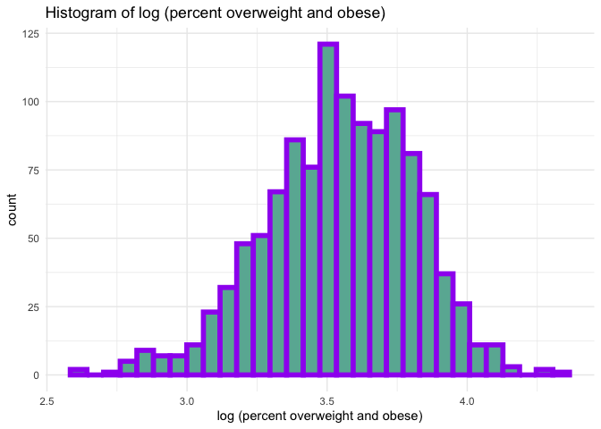

Regression - Statistical Analysis
================

``` r
library(tidyverse)
```

    ## ── Attaching packages ───────────────────────────────────────────────────────────────────────────────── tidyverse 1.3.0 ──

    ## ✓ ggplot2 3.3.2     ✓ purrr   0.3.4
    ## ✓ tibble  3.0.3     ✓ dplyr   1.0.2
    ## ✓ tidyr   1.1.2     ✓ stringr 1.4.0
    ## ✓ readr   1.3.1     ✓ forcats 0.5.0

    ## ── Conflicts ──────────────────────────────────────────────────────────────────────────────────── tidyverse_conflicts() ──
    ## x dplyr::filter() masks stats::filter()
    ## x dplyr::lag()    masks stats::lag()

``` r
library(patchwork)
```

# Clean the orginal weight dataset

``` r
original = tibble(
  read.csv("./dataset/Student_Weight_Status_Category_Reporting_Results__Beginning_2010.csv")
) %>%
  janitor::clean_names() %>%
  select(-location_code, -region, -area_name)  # the only location information we need is county name
```

# Clean dataset with geolocation information

``` r
#import coordinates data set 
coordinates = tibble(
  read.csv("./dataset/Geocodes_USA_with_Counties.csv")
) %>%
  filter(state == "NY") %>%  # filter out counties outside NY state
  select(county, latitude, longitude) %>% # only information we need is county name and geolocation
  drop_na() %>%
  group_by(county) %>%
  summarise(latitude = mean(latitude), longitude = mean(longitude)) %>% #different location in each county variaed slightly, so we take the mean of each county's geolocation
  filter(!county == "") %>% # one county's name input is blank
  mutate(county = toupper(county)) # to swith county name to uppercase
```

    ## `summarise()` ungrouping output (override with `.groups` argument)

# combine two data set

``` r
weight_df = left_join(original, coordinates, by = "county")
```

# Further orginal dataset cleanning for linea regression analysis

``` r
linear_df = weight_df %>%
  filter(!sex == "ALL") %>%
  filter(!grade_level == "DISTRICT TOTAL") %>%
  mutate(
    sex = if_else(sex == "MALE", 0, 1),
    grade_level = if_else(grade_level == "ELEMENTARY", 0, 1)
  ) %>%
  drop_na() %>%
  filter(year_reported %in% c("2018-2019")) #only analyzing data in year 2018-2019
```

# Normality check

``` r
qqnorm(linear_df$percent_overweight_or_obese)
```

<!-- -->

``` r
hist(linear_df$percent_overweight_or_obese)
```

<!-- -->

# regression model

``` r
lm_1 = lm(percent_overweight_or_obese ~ sex + grade_level, data = linear_df)

summary(lm_1)
```

    ## 
    ## Call:
    ## lm(formula = percent_overweight_or_obese ~ sex + grade_level, 
    ##     data = linear_df)
    ## 
    ## Residuals:
    ##     Min      1Q  Median      3Q     Max 
    ## -23.231  -5.918  -0.224   5.782  41.634 
    ## 
    ## Coefficients:
    ##             Estimate Std. Error t value Pr(>|t|)    
    ## (Intercept)  33.3655     0.4335  76.969   <2e-16 ***
    ## sex          -0.5126     0.5101  -1.005    0.315    
    ## grade_level   5.7652     0.5108  11.287   <2e-16 ***
    ## ---
    ## Signif. codes:  0 '***' 0.001 '**' 0.01 '*' 0.05 '.' 0.1 ' ' 1
    ## 
    ## Residual standard error: 8.701 on 1161 degrees of freedom
    ## Multiple R-squared:  0.09971,    Adjusted R-squared:  0.09816 
    ## F-statistic: 64.29 on 2 and 1161 DF,  p-value: < 2.2e-16
