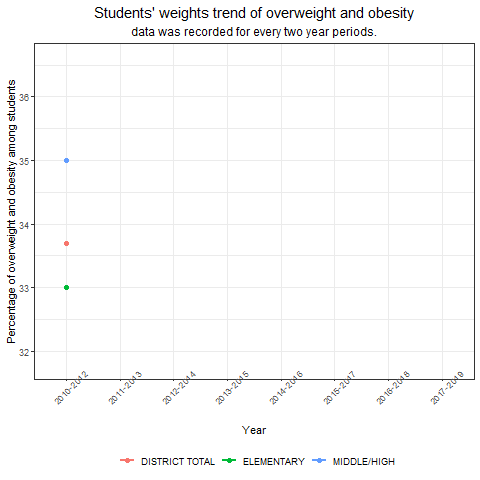
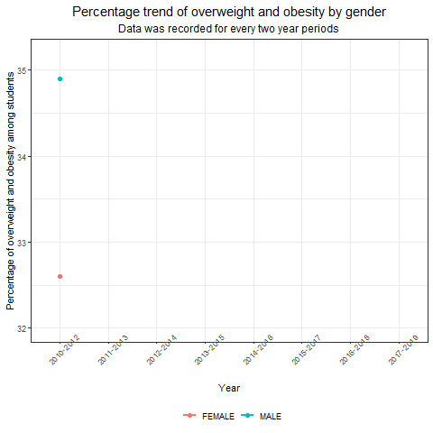
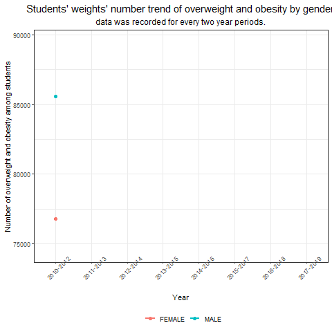

```{r,include=FALSE}
library(tidyverse)
library(ggplot2)
library(broom)
library(plotly)
library(highcharter)
library(rworldmap)
library(gganimate)
library(transformr)
library(corrplot)
library(leaps)
library(kableExtra)
library(magick)
knitr::opts_chunk$set(
 echo = FALSE,
 fig.width = 7, 
 fig.height = 5,
 fig.asp = 0.6,
 out.width = "60%")
theme_set(theme_bw() + 
          theme(legend.position = "bottom",
                legend.title = element_blank(),
                plot.title = element_text(hjust = 0.5, size = 15),
                plot.subtitle = element_text(hjust = 0.5, size = 12)))
maindata <- read.csv("./dataset/Student_Weight_Status_Category_Reporting_Results__Beginning_2010.csv") %>%
  janitor::clean_names()
```

## Overweight and obsesity percentage trend for students from 2010 to 2019 in NY


```{r,echo=FALSE,fig.align='center'}
statewide <- maindata %>%
  filter(county == "STATEWIDE (EXCLUDING NYC)",
         sex == "ALL") %>%
  group_by(grade_level) %>%
  mutate(year_reported = as.factor(year_reported)) %>%
  ggplot(aes(x = year_reported, y = percent_overweight_or_obese, group = grade_level, color = grade_level)) + 
  geom_line(size = 1) + 
  geom_point(size = 2) + 
  labs(title = "Students' weights trend of overweight and obesity",
       subtitle = "data was recorded for every two year periods.",
       x = "Year", 
       y = "Percentage of overweight and obesity among students") +
  theme(axis.text.x = element_text(angle = 45))

gif1 <- animate(statewide + geom_point(aes(group = seq_along(year_reported)), size = 2) + transition_reveal(as.numeric(year_reported))+ enter_fade()+exit_shrink(), fps = 20)

anim_save("gif1.gif",gif1)
```



## Overweight and obsesity percentage trend for students by gender from 2010 to 2019 in NY

percentage
```{r,echo=FALSE,fig.align='center'}
genderperc <- maindata %>%
  filter(county == "STATEWIDE (EXCLUDING NYC)",
         sex %in% c("FEMALE","MALE"),
         grade_level == "DISTRICT TOTAL") %>%
  select(c(year_reported,sex,percent_overweight_or_obese)) %>%
  group_by(sex) %>%
  mutate(year_reported = as.factor(year_reported)) %>%
  ggplot(aes(x = year_reported, y = percent_overweight_or_obese, group = sex, color = sex)) + 
  geom_line(size = 1) + 
  geom_point(size = 2) + 
  labs(title = "Percentage trend of overweight and obesity by gender",
       subtitle = "Data was recorded for every two year periods",
       x = "Year", 
       y = "Percentage of overweight and obesity among students") +
  theme(axis.text.x = element_text(angle = 45)) %>%
  na.omit()

gif2 <- animate(genderperc + transition_reveal(as.numeric(year_reported)) + enter_fade() + exit_shrink(), fps = 20)

anim_save("gif2.gif", gif2)
```



number 
```{r,echo=FALSE,fig.align='center'}
gender_num <- maindata %>%
  filter(county == "STATEWIDE (EXCLUDING NYC)",
         sex %in% c("FEMALE","MALE"),
         grade_level == "DISTRICT TOTAL") %>%
  group_by(year_reported, sex) %>%
  mutate(year_reported = as.factor(year_reported)) %>%
  ggplot(aes(x = year_reported, y = number_overweight_or_obese, group = sex, color = sex)) + 
  geom_line(size = 1) + 
  geom_point(size = 2) + 
  labs(title = "Students' weights' number trend of overweight and obesity by gender",
       subtitle = "data was recorded for every two year periods.",
       x = "Year", 
       y = "Number of overweight and obesity among students") +
  theme(axis.text.x = element_text(angle = 45))

gif3 <- gender_num + geom_point(aes(group = seq_along(year_reported))) + transition_reveal(as.numeric(year_reported))

anim_save("gif3.gif",gif3)
```




