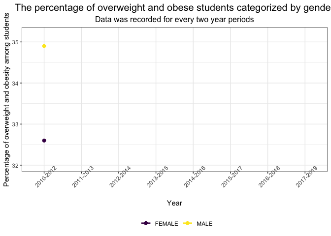

```{r,include=FALSE}
library(tidyverse)
library(ggplot2)
library(broom)
library(plotly)
library(highcharter)
library(rworldmap)
library(gganimate)
library(transformr)
library(corrplot)
library(leaps)
library(kableExtra)
library(magick)
library(dplyr)
library(gifski)

knitr::opts_chunk$set(
 echo = FALSE,
 fig.width = 7, 
 fig.height = 5,
 fig.asp = 0.6,
 out.width = "60%")
theme_set(theme_bw() + 
          theme(legend.position = "bottom",
                legend.title = element_blank(),
                plot.title = element_text(hjust = 0.5, size = 15),
                plot.subtitle = element_text(hjust = 0.5, size = 12)))


maindata <- read.csv("./dataset/Student_Weight_Status_Category_Reporting_Results__Beginning_2010.csv") %>%
  janitor::clean_names()
```

## Overweight and obsesity percentage trend for students from 2010 to 2019 in NY

```{r,echo=FALSE,fig.align='center'}
statewide <- maindata %>%
  filter(county == "STATEWIDE (EXCLUDING NYC)",
         sex == "ALL") %>%
  group_by(grade_level) %>%
  mutate(year_reported = as.factor(year_reported)) %>%
  ggplot(aes(x = year_reported, y = percent_overweight_or_obese, group = grade_level, color = grade_level)) + 
  geom_line(size = 1) + 
  geom_point(size = 2) + 
  labs(title = "Students' weights trend of overweight and obesity",
       subtitle = "data was recorded for every two year periods.",
       x = "Year", 
       y = "Percentage of overweight and obesity among students") +
  theme(axis.text.x = element_text(angle = 45))

gif1 <- animate(statewide + geom_point(aes(group = seq_along(year_reported)), size = 2) + transition_reveal(as.numeric(year_reported))+ enter_fade() + exit_shrink(), fps = 25)

anim_save("gif1.gif",gif1)
```


## Overweight and obsesity percentage trend for students by gender from 2010 to 2019 in NY

percentage
```{r,echo=FALSE,fig.align='center'}
genderperc <- maindata %>%
  filter(county == "STATEWIDE (EXCLUDING NYC)",
         sex %in% c("FEMALE","MALE"),
         grade_level == "DISTRICT TOTAL") %>%
  select(c(year_reported,sex,percent_overweight_or_obese)) %>%
  group_by(sex) %>%
  mutate(year_reported = as.factor(year_reported)) %>%
  ggplot(aes(x = year_reported, y = percent_overweight_or_obese, group = sex, color = sex)) + 
  geom_line(size = 1) + 
  geom_point(size = 2) + 
  labs(title = "Percentage trend of overweight and obesity by gender",
       subtitle = "Data was recorded for every two year periods",
       x = "Year", 
       y = "Percentage of overweight and obesity among students") +
  theme(axis.text.x = element_text(angle = 45)) %>%
  na.omit()

gif2 <- animate(genderperc +geom_point(aes(group = seq_along(year_reported)), size = 2)+ transition_reveal(as.numeric(year_reported)) + enter_fade() + exit_shrink(), fps = 25)

anim_save("gif2.gif", gif2)
```



number 
```{r,echo=FALSE,fig.align='center'}
gender_num <- maindata %>%
  filter(county == "STATEWIDE (EXCLUDING NYC)",
         sex %in% c("FEMALE","MALE"),
         grade_level == "DISTRICT TOTAL") %>%
  group_by(year_reported, sex) %>%
  mutate(year_reported = as.factor(year_reported)) %>%
  ggplot(aes(x = year_reported, y = number_overweight_or_obese, group = sex, color = sex)) + 
  geom_line(size = 1) + 
  geom_point(size = 2) + 
  labs(title = "Students' weights' number trend of overweight and obesity by gender",
       subtitle = "data was recorded for every two year periods.",
       x = "Year", 
       y = "Number of overweight and obesity among students") +
  theme(axis.text.x = element_text(angle = 45))

gif3 <- animate(gender_num + geom_point(aes(group = seq_along(year_reported))) + transition_reveal(as.numeric(year_reported)) + enter_fade() + exit_shrink(), fps = 25)

anim_save("gif3.gif",gif3)
```


## Overweight percentage compare to obsesity percentage for students by age from 2010 to 2019 in NY


```{r,echo=FALSE,fig.align='center'}
compare_obese <- maindata %>%
  filter(county == "STATEWIDE (EXCLUDING NYC)",
         sex == "ALL") %>%
  select(c(year_reported,percent_overweight,percent_obese,grade_level)) %>%
  tidyr::gather("percent_overweight","percent_obese", 2:3) %>%
  mutate(weight_status = str_sub(percent_overweight,9,-1),
         percentage = percent_obese) %>%
  select(-percent_overweight, -percent_obese) %>%
  group_by(grade_level) %>%
  mutate(year_reported = as.factor(year_reported))

gif4 <- ggplot(compare_obese, aes(x = grade_level, y = percentage, fill = weight_status)) +
  geom_bar(stat = "identity",position = "dodge") +
  labs(title='Every two years period: {closest_state}',
    subtitle = "Overweight percentage compare to obsesity percentage",
       x = "Grade level", 
       y = "Percentage of obese/overweight among total") +
  theme_bw()+
  transition_states(
    year_reported,
    transition_length = 1,
    state_length = 1
  )+
  ease_aes("sine-in-out")

anim_save("gif4.gif", gif4)

```


## Counties with obesity percentage comparison


```{r,echo=FALSE,fig.align='center'}

dt_count = data.frame()

counties <- maindata %>%
  filter(county != "STATEWIDE (EXCLUDING NYC)",
         grade_level == "DISTRICT TOTAL",
         sex == "ALL") %>%
  select(c(county, year_reported, percent_overweight_or_obese, area_name)) %>%
  group_by(county) %>%
  mutate(year_reported = as.factor(year_reported)) %>%
#  pivot_wider(names_from = county, values_from = percent_overweight_or_obese) %>%
  separate(year_reported, c("start_year","end_year"), "-") %>%
  mutate(start_year = as.numeric(start_year),
         end_year = as.numeric(end_year),
         start_year1 = start_year+2) %>%
  na.omit()

for (i in 1:nrow(counties)) {
    if (counties$end_year[i] == counties$start_year1[i]) {
      dt_count <- rbind(dt_count, counties[i,])
    }
}

counties = dt_count %>%
  filter(county != "N/A") %>%
  select(-start_year1) %>%
  mutate(
    year = paste(start_year, end_year, sep = "-")
  ) %>%
  select(-start_year, -end_year, -area_name) %>%
  group_by(year)

new_county = counties %>%
  pivot_wider(names_from = county, values_from = percent_overweight_or_obese)

top20 = new_county %>%
  ungroup() %>%
  select(-year)

county20 = rbind(top20, colMeans = colMeans(top20)) %>%
  mutate(num = c(1,2,3,4,5,6,7,8,"mean")) %>%
  filter(num %in% "mean") %>%
  pivot_longer(cols = 1:57,names_to = "county", values_to = "percentage") %>%
  select(-num) %>%
  top_n(20)

county_20 = inner_join(county20,counties) %>%
  select(-percentage) %>%
  group_by(year) %>%
  mutate(percent_overweight_or_obese = percent_overweight_or_obese * 1000,
        rank = rank(-percent_overweight_or_obese),
         Value_rel = percent_overweight_or_obese/percent_overweight_or_obese[rank==1],
         Value_lbl = paste0(" ",round(percent_overweight_or_obese/1e9))) %>%
  ungroup()

p <- ggplot(county_20, aes(rank, group = county, 
                     fill = as.factor(county), color = as.factor(county))) +
  geom_tile(aes(y = percent_overweight_or_obese/2,
                height = percent_overweight_or_obese,
                width = 0.9), alpha = 0.5, color = NA) +
  geom_text(aes(y = 0, label = paste(county, " ")), vjust = 0.2, hjust = 1) +
  coord_flip(clip = "off", expand = FALSE) +
  scale_y_continuous(labels = scales::comma) +
  scale_x_reverse() +
  guides(color = FALSE, fill = FALSE) +
  labs(title='Every two years period: {closest_state}', x = "", y = "Overweight or obese students per 100K in each county") +
  theme(plot.title = element_text(hjust = 0, size = 22),
        axis.ticks.y = element_blank(),  # These relate to the axes post-flip
        axis.text.y  = element_blank(),  # These relate to the axes post-flip
        plot.margin = margin(2,2,2,4, "cm")) +

  transition_states(year, transition_length = 4, state_length = 1) +
  ease_aes('cubic-in-out')

final_animation<-animate(p, fps = 25, duration = 20, width = 1000, height = 1000, renderer = gifski_renderer())

anim_save("final_animation.gif", final_animation)
```


```{r,include=FALSE,eval=FALSE,fig.align='center'}

dt_count = data.frame()

counties <- maindata %>%
  filter(county != "STATEWIDE (EXCLUDING NYC)",
         grade_level == "DISTRICT TOTAL",
         sex == "ALL") %>%
  select(c(county, year_reported, percent_overweight_or_obese, area_name)) %>%
  group_by(county) %>%
  mutate(year_reported = as.factor(year_reported)) %>%
#  pivot_wider(names_from = county, values_from = percent_overweight_or_obese) %>%
  separate(year_reported, c("start_year","end_year"), "-") %>%
  mutate(start_year = as.numeric(start_year),
         end_year = as.numeric(end_year),
         start_year1 = start_year+2) %>%
  na.omit()

for (i in 1:nrow(counties)) {
    if (counties$end_year[i] == counties$start_year1[i]) {
      dt_count <- rbind(dt_count, counties[i,])
    }
}

counties = dt_count %>%
  filter(county != "N/A") %>%
  select(-start_year1) %>%
  mutate(
    year = paste(start_year, end_year, sep = "-")
  ) %>%
  select(-start_year, -end_year, -area_name) %>%
  group_by(year)


county_20 = counties %>%
  group_by(year) %>%
  mutate(percent_overweight_or_obese = percent_overweight_or_obese * 1000,
        rank = rank(-percent_overweight_or_obese),
         Value_rel = percent_overweight_or_obese/percent_overweight_or_obese[rank==1],
         Value_lbl = paste0(" ",round(percent_overweight_or_obese/1e9))) %>%
  filter (rank <=20) %>%
  ungroup()

p <- ggplot(county_20, aes(rank, group = county, 
                     fill = as.factor(county), color = as.factor(county))) +
  geom_tile(aes(y = percent_overweight_or_obese/2,
                height = percent_overweight_or_obese,
                width = 0.9), alpha = 0.5, color = NA) +
  geom_text(aes(y = 0, label = paste(county, " ")), vjust = 0.2, hjust = 1) +
  coord_flip(clip = "off", expand = FALSE) +
  scale_y_continuous(labels = scales::comma) +
  scale_x_reverse() +
  guides(color = FALSE, fill = FALSE) +
  labs(title='Every two years period: {closest_state}', x = "", y = "Overweight or obese students per 100K in each county") +
  theme(plot.title = element_text(hjust = 0, size = 22),
        axis.ticks.y = element_blank(),  # These relate to the axes post-flip
        axis.text.y  = element_blank(),  # These relate to the axes post-flip
        plot.margin = margin(2,2,2,4, "cm")) +

  transition_states(year, transition_length = 4, state_length = 1) +
  ease_aes('cubic-in-out')

final_animation1 <-animate(p, fps = 25, duration = 20, width = 1000, height = 1000, renderer = gifski_renderer())

anim_save("final_animation_no_mean.gif", final_animation1)
```

